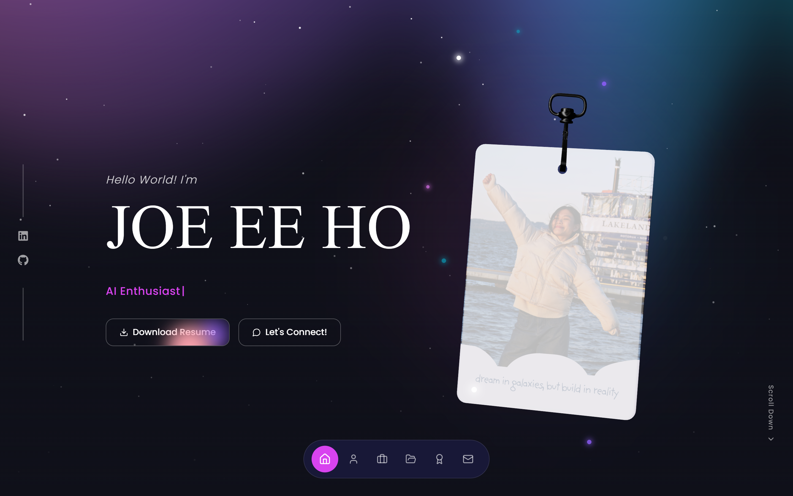

<div align="center">

# Joe Ee Ho — Portfolio (v1, Archived)

An interactive, space-themed personal portfolio built with Next.js, Three.js and WebGL shaders.

**[🌐 Live demo of this version](https://joeee-website-archived.vercel.app)** · **[✨ My current website → joeee.dev](https://joeee.dev)**

</div>



---

## 👋 Hey there!

This is the **archived first version** of my personal website. I've since rebuilt it from scratch — you can find the current one at **[joeee.dev](https://joeee.dev)**.

I'm keeping this repo public because a few people have found the animations here useful, and I'd rather share it than hide it. Feel free to read the code, learn from it, and borrow ideas.

> **Looking for my up-to-date work, projects and contact details?**
> Head over to **[joeee.dev](https://joeee.dev)** — that's where everything current lives. This repo is frozen in time. 🕰️

---

## 🙏 A small, friendly ask

This project is MIT licensed, so **yes — you're genuinely welcome to use it**, fork it, remix it, and build your own portfolio on top of it. That's a compliment, and I'm glad it's useful!

If it does help you, here's what I'd really appreciate:

- ⭐ **Star the repo** — it takes two seconds and honestly makes my day.
- 🍴 **Fork it instead of copying it silently** — forking keeps the connection visible, and costs you nothing.
- 🔗 **Keep a small credit** — a line in your own README or footer like:

  ```
  Design inspired by Joe Ee Ho's portfolio — https://github.com/wthislifehuh/joeee-website-archived
  ```

- 📄 **Keep the LICENSE file** — this one isn't just etiquette. The MIT license asks that the copyright notice stays with the code, so please leave `LICENSE` in place if you reuse a meaningful chunk of it.

None of this is meant to gatekeep anything. I built this while learning, largely from other people who shared their work openly, so I know exactly how valuable that is. A star and a link are all I'm asking for in return. 💜

And if you *do* build something with it — [I'd love to see it](#-say-hello). Seriously, send me a link!

---

## ✨ What's in here

| Section | What it does |
| --- | --- |
| **Hero** | Aurora shader background, starfield particles, pressure-responsive name typography, a typing-effect subtitle, and a 3D lanyard card you can physically drag and swing |
| **About** | Personal introduction with education and skills cards |
| **Experience** | Technical skills grid plus a work-experience timeline |
| **Portfolio** | Project showcase with imagery |
| **Leadership** | Timeline of leadership roles, with separate desktop and mobile treatments |
| **Publications** | Research and writing |
| **Achievements** | Award tiles with preview cards |
| **Contact** | Get-in-touch section and footer |

Tying it together: a floating dock navigation, an infinite scrolling tech-logo loop, scroll-driven text and card animations, and smooth scrolling throughout.

## 🛠️ Built with

- **[Next.js 15](https://nextjs.org)** (App Router) + **React 18** + **TypeScript**
- **[Tailwind CSS](https://tailwindcss.com)** for styling
- **[Three.js](https://threejs.org)** via **[React Three Fiber](https://r3f.docs.pmnd.rs)** and **[Drei](https://drei.docs.pmnd.rs)** — the 3D lanyard card
- **[React Three Rapier](https://github.com/pmndrs/react-three-rapier)** — physics for the lanyard swing
- **[OGL](https://github.com/oframe/ogl)** — the aurora shader background
- **[GSAP](https://gsap.com)** — scroll-driven animations
- **[Lenis](https://lenis.darkroom.engineering)** — smooth scrolling
- **[Biome](https://biomejs.dev)** for formatting and linting

## 🚀 Running it locally

You'll need **Node.js 18+**.

```bash
git clone https://github.com/wthislifehuh/joeee-website-archived.git
cd joeee-website-archived
npm install
npm run dev
```

Then open **[http://localhost:3000](http://localhost:3000)**.

No environment variables or API keys are required — everything runs client-side.

### Other scripts

```bash
npm run build    # production build
npm start        # serve the production build
npm run lint     # type-check and lint
npm run format   # format with Biome
```

> **Heads up:** the hero is WebGL-heavy. If the lanyard card doesn't appear, check that hardware acceleration is enabled in your browser.

## 📁 Project structure

```
src/
├── app/
│   ├── layout.tsx           # Root layout, fonts, metadata
│   ├── page.tsx             # Single-page composition of all sections
│   └── globals.css          # Theme tokens and global styles
├── components/
│   ├── sections/            # Hero, About, Experience, Portfolio, etc.
│   └── ui/                  # Reusable animated primitives
└── lib/                     # Utilities
public/                      # Images, 3D models (.glb), resume PDF
```

## 🎨 Design notes

The palette leans into a deep-space feel:

- Deep navy background — `#0f0f23` → `#1a1a3e`
- Pink / magenta accent — `#e879f9` / `#d946ef`
- Aurora gradient stops — `#e879f9`, `#8b5cf6`, `#06b6d4`
- Card surfaces with subtle blue tints, white text at varying opacity

## 💐 Credits

Several of the animated UI primitives — including the aurora background, lanyard card, text-pressure effect, logo loop and scroll animations — were adapted from **[React Bits](https://reactbits.dev)** (MIT licensed). Huge thanks to that project; it saved me a lot of time and taught me plenty.

## 📄 License

[MIT](LICENSE) © Joe Ee Ho

Use it freely — just keep the license notice, and a star or a credit link would mean a lot. 🌟

## 📬 Say hello

- 🌐 Current website — **[joeee.dev](https://joeee.dev)**
- 💼 LinkedIn — **[joe-ee-ho](https://www.linkedin.com/in/joe-ee-ho/)**
- 🐙 GitHub — **[@wthislifehuh](https://github.com/wthislifehuh)**

<div align="center">

**Thanks for stopping by — and for reading this far!** ✨

*Dream in galaxies, but build in reality.*

</div>
